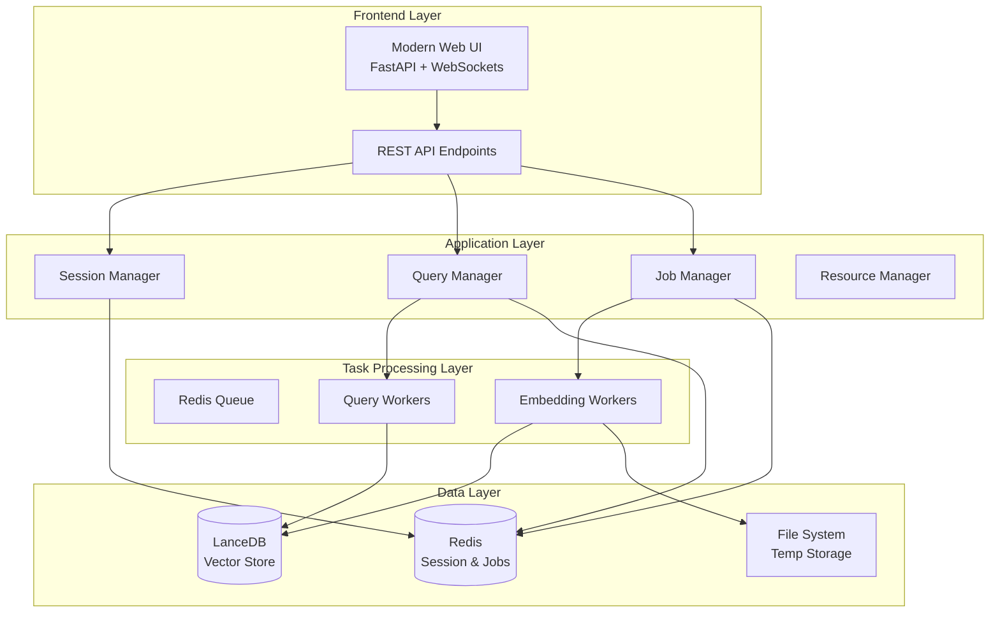

# Design Document

## Overview

This design transforms the existing single-threaded RAG system into a robust, concurrent, production-ready application. The solution addresses three critical areas: eliminating data leakage through proper concurrency controls, optimizing performance through intelligent queuing and resource management, and enhancing user experience with a modern, responsive interface.

The architecture introduces a task queue system using Redis and Celery for background processing, implements proper session management and thread safety, and provides a modern web interface with real-time updates. The system maintains backward compatibility while adding enterprise-grade features like job monitoring, resource management, and comprehensive error handling.

## Architecture

### High-Level Architecture



### Component Architecture

The system is restructured into distinct, loosely-coupled components:

1. **Web Application Layer**: FastAPI-based REST API with WebSocket support for real-time updates
2. **Task Queue Layer**: Redis-backed Celery workers for background processing
3. **Resource Management Layer**: Intelligent resource allocation and monitoring
4. **Data Access Layer**: Thread-safe data access with proper isolation
5. **Session Management Layer**: Secure, distributed session handling

## Components and Interfaces

### 1. Web Application Server (FastAPI)

**Purpose**: Replace Gradio with a modern, scalable web framework that supports concurrent users and real-time updates.

**Key Features**:
- RESTful API endpoints for all operations
- WebSocket connections for real-time job status updates
- Static file serving for modern frontend assets
- Comprehensive request validation and error handling
- Built-in OpenAPI documentation

**Interfaces**:
```python
# Authentication endpoints
POST /api/auth/login
POST /api/auth/logout
GET /api/auth/session

# Document management endpoints
POST /api/documents/upload
GET /api/documents/list
DELETE /api/documents/{doc_id}

# Query endpoints
POST /api/query
GET /api/query/{query_id}/status

# Job management endpoints
GET /api/jobs
GET /api/jobs/{job_id}
DELETE /api/jobs/{job_id}

# WebSocket endpoint
WS /ws/updates
```

### 2. Task Queue System (Celery + Redis)

**Purpose**: Handle background processing of embedding and query operations with proper resource management and user isolation.

**Architecture**:
- **Redis**: Message broker and result backend
- **Celery Workers**: Dedicated processes for different task types
- **Task Routing**: Intelligent task distribution based on resource availability

**Worker Types**:
- **Embedding Workers**: Handle document processing and embedding generation
- **Query Workers**: Process user queries with proper security isolation
- **Maintenance Workers**: Handle cleanup, monitoring, and system maintenance

**Task Definitions**:
```python
@celery.task(bind=True)
def process_document_embedding(self, job_id, user_id, group_id, file_paths):
    """Process document embedding with progress tracking"""

@celery.task(bind=True)
def process_user_query(self, query_id, user_id, group_ids, query_text):
    """Process user query with security isolation"""

@celery.task
def cleanup_expired_sessions():
    """Periodic cleanup of expired sessions and temp files"""
```

### 3. Session Management System

**Purpose**: Provide secure, distributed session management that works across multiple processes and workers.

**Implementation**:
- **Redis-backed sessions**: Store session data in Redis for cross-process access
- **JWT tokens**: Stateless authentication tokens for API access
- **Session isolation**: Ensure user data never leaks between sessions

**Session Data Structure**:
```python
{
    "session_id": "uuid",
    "user_id": "username",
    "groups": ["group1", "group2"],
    "created_at": timestamp,
    "last_activity": timestamp,
    "permissions": ["upload", "query", "delete"]
}
```

### 4. Resource Management System

**Purpose**: Intelligently manage system resources to prevent overload and ensure fair resource allocation.

**Components**:
- **Memory Monitor**: Track memory usage and prevent OOM conditions
- **CPU Monitor**: Monitor CPU usage and adjust worker concurrency
- **Queue Monitor**: Track queue lengths and processing times
- **Resource Allocator**: Dynamically adjust resource allocation based on load

**Resource Limits**:
```python
RESOURCE_LIMITS = {
    "max_concurrent_embeddings": 2,  # Prevent memory exhaustion
    "max_concurrent_queries": 10,    # Balance throughput and latency
    "max_memory_per_worker": "2GB",  # Prevent individual worker overuse
    "max_queue_size": 100,           # Prevent unbounded queue growth
    "worker_timeout": 300            # Prevent stuck workers
}
```

### 5. Job Management System

**Purpose**: Provide comprehensive job tracking, monitoring, and management capabilities.

**Features**:
- **Job Status Tracking**: Real-time status updates for all operations
- **Progress Reporting**: Detailed progress information for long-running tasks
- **Error Handling**: Comprehensive error capture and reporting
- **Job History**: Maintain history of completed jobs for auditing

**Job States**:
```python
class JobStatus(Enum):
    PENDING = "pending"
    PROCESSING = "processing"
    COMPLETED = "completed"
    FAILED = "failed"
    CANCELLED = "cancelled"
```

### 6. Enhanced Query Engine

**Purpose**: Provide thread-safe, secure query processing with improved performance and user isolation.

**Improvements**:
- **Connection Pooling**: Reuse database connections across requests
- **Query Caching**: Cache frequent queries to improve response times
- **Security Isolation**: Ensure complete user data isolation
- **Performance Monitoring**: Track query performance and optimize bottlenecks

**Security Model**:
```python
def create_user_filters(user_id: str, group_ids: List[str]) -> MetadataFilters:
    """Create security filters that ensure user can only access authorized documents"""
    user_filter = ExactMatchFilter(key="user_id", value=user_id)
    group_filters = [ExactMatchFilter(key="group_id", value=gid) for gid in group_ids]
    return MetadataFilters(filters=[user_filter] + group_filters, condition="or")
```

## Data Models

### User Session Model
```python
@dataclass
class UserSession:
    session_id: str
    user_id: str
    groups: List[str]
    created_at: datetime
    last_activity: datetime
    permissions: List[str]
    is_active: bool = True
```

### Job Model
```python
@dataclass
class Job:
    job_id: str
    user_id: str
    job_type: str  # "embedding" or "query"
    status: JobStatus
    created_at: datetime
    started_at: Optional[datetime]
    completed_at: Optional[datetime]
    progress: float  # 0.0 to 1.0
    result: Optional[Dict[str, Any]]
    error: Optional[str]
    metadata: Dict[str, Any]
```

### Document Model
```python
@dataclass
class Document:
    document_id: str
    user_id: str
    group_id: str
    filename: str
    file_size: int
    upload_date: datetime
    processing_status: str
    page_count: Optional[int]
    chunk_count: Optional[int]
```

### Query Model
```python
@dataclass
class Query:
    query_id: str
    user_id: str
    query_text: str
    created_at: datetime
    processing_time: Optional[float]
    result_count: Optional[int]
    status: str
```

## Error Handling

### Error Categories
1. **Authentication Errors**: Invalid credentials, expired sessions
2. **Authorization Errors**: Insufficient permissions, access denied
3. **Validation Errors**: Invalid input data, malformed requests
4. **Resource Errors**: Memory exhaustion, disk space, timeout
5. **System Errors**: Database connection, service unavailable

### Error Response Format
```python
{
    "error": {
        "code": "RESOURCE_EXHAUSTED",
        "message": "System is currently at capacity. Please try again later.",
        "details": {
            "queue_length": 50,
            "estimated_wait_time": "5 minutes"
        },
        "timestamp": "2025-01-21T10:30:00Z"
    }
}
```

### Error Recovery Strategies
- **Automatic Retry**: For transient failures with exponential backoff
- **Graceful Degradation**: Reduce functionality when resources are constrained
- **Circuit Breaker**: Prevent cascade failures by temporarily disabling failing components
- **Dead Letter Queue**: Handle permanently failed tasks for manual intervention

## Testing Strategy

### Unit Testing
- **Component Isolation**: Test each component independently with mocks
- **Security Testing**: Verify user isolation and access controls
- **Resource Management**: Test resource limits and cleanup
- **Error Handling**: Comprehensive error scenario testing

### Integration Testing
- **End-to-End Workflows**: Test complete user journeys
- **Concurrency Testing**: Verify thread safety and data isolation
- **Performance Testing**: Load testing with multiple concurrent users
- **Failure Testing**: Test system behavior under various failure conditions

### Test Environment Setup
```python
# Test configuration
TEST_CONFIG = {
    "redis_url": "redis://localhost:6379/1",  # Separate test database
    "test_db_path": "./test_db.lance",
    "max_test_workers": 2,
    "test_timeout": 30
}

# Test fixtures
@pytest.fixture
def test_user_session():
    return UserSession(
        session_id="test-session",
        user_id="test-user",
        groups=["test-group"],
        created_at=datetime.now(),
        last_activity=datetime.now(),
        permissions=["upload", "query"]
    )
```

### Performance Benchmarks
- **Query Response Time**: < 2 seconds for 95th percentile
- **Document Processing**: < 30 seconds per MB of PDF content
- **Concurrent Users**: Support 50+ concurrent users
- **Memory Usage**: < 4GB total system memory under normal load
- **Queue Processing**: < 5 minute wait time under normal load

### Security Testing
- **User Isolation**: Verify users cannot access other users' documents
- **Session Security**: Test session hijacking and replay attacks
- **Input Validation**: Test SQL injection, XSS, and other injection attacks
- **Rate Limiting**: Verify rate limits prevent abuse
- **Authentication**: Test various authentication bypass scenarios