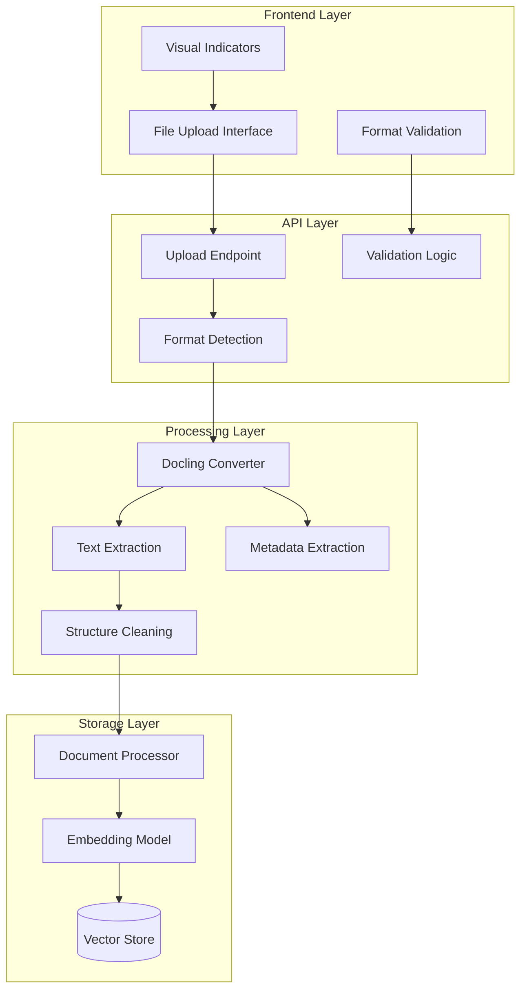

# Docling Multi-Format Document Support - Design Document

## Overview

This design document outlines the upgrade from PyMuPDF (fitz) to Docling for multi-format document processing in the RAG system. The solution provides comprehensive document format support while maintaining backward compatibility and improving text extraction quality through advanced OCR and structure recognition capabilities.

## Architecture

### Document Processing Pipeline



### Supported Document Formats

| Format | Extension | Docling InputFormat | Features |
|--------|-----------|-------------------|----------|
| PDF | `.pdf` | `InputFormat.PDF` | OCR, table extraction, layout preservation |
| Word | `.docx` | `InputFormat.DOCX` | Full text extraction, formatting preservation |
| PowerPoint | `.pptx` | `InputFormat.PPTX` | Slide content extraction, text and layout |
| Excel | `.xlsx`, `.xls` | `InputFormat.XLSX` | Cell data extraction, sheet processing |
| HTML | `.html` | `InputFormat.HTML` | Tag-aware text extraction, structure preservation |
| Markdown | `.md` | `InputFormat.MD` | Native markdown processing, structure awareness |
| CSV | `.csv` | `InputFormat.CSV` | Tabular data processing, column extraction |

## Implementation Details

### Core Components

#### 1. Document Utils Module (`app/shared/pdf_utils.py`)

**Key Functions:**
- `extract_text_from_document(file_path: str) -> List[Tuple[str, int]]`
- `get_document_metadata(file_path: str) -> dict`
- `is_supported_format(file_path: str) -> bool`
- `get_supported_extensions() -> List[str]`

**Backward Compatibility:**
- `extract_text_from_pdf()` - maintained for existing code
- `get_pdf_metadata()` - maintained for existing code

#### 2. Document Processor Enhancement

**Updated Methods:**
- `_build_nodes_from_documents()` - replaces `_build_nodes_from_pdfs()`
- Enhanced error handling for multiple formats
- Format-specific metadata inclusion

#### 3. API Endpoint Updates

**Upload Validation:**
```python
from ..shared.pdf_utils import is_supported_format, get_supported_extensions

if not is_supported_format(file.filename):
    supported_formats = ', '.join(get_supported_extensions())
    raise HTTPException(
        status_code=400,
        detail=f"Unsupported file format. Supported: {supported_formats}"
    )
```

#### 4. Frontend Enhancements

**File Type Detection:**
```javascript
isSupportedFileType(file) {
    // MIME type check
    if (this.supportedFileTypes[file.type]) return true;
    
    // Extension fallback
    const supportedExtensions = ['.pdf', '.docx', '.pptx', '.xlsx', '.xls', '.html', '.md', '.csv'];
    return supportedExtensions.some(ext => file.name.toLowerCase().endsWith(ext));
}
```

**Visual Indicators:**
```javascript
getFileIcon(fileName) {
    const ext = fileName.toLowerCase().split('.').pop();
    switch (ext) {
        case 'pdf': return '<i class="fas fa-file-pdf"></i>';
        case 'docx': return '<i class="fas fa-file-word"></i>';
        case 'pptx': return '<i class="fas fa-file-powerpoint"></i>';
        case 'xlsx': return '<i class="fas fa-file-excel"></i>';
        case 'html': return '<i class="fas fa-file-code"></i>';
        case 'md': return '<i class="fab fa-markdown"></i>';
        case 'csv': return '<i class="fas fa-file-csv"></i>';
        default: return '<i class="fas fa-file"></i>';
    }
}
```

### Text Extraction Strategy

#### Primary Method: Markdown Export
```python
try:
    # Use Docling's markdown export for consistent structure
    doc_text = result.document.export_to_markdown()
    pages.append((doc_text, 1))
except AttributeError:
    # Fallback to manual extraction
    # ... fallback logic
```

#### Fallback Methods:
1. Page-by-page extraction for paginated documents
2. Direct text attribute access
3. Body element text extraction

### Error Handling Strategy

#### Graceful Degradation:
1. **File Level**: Continue processing other files if one fails
2. **Format Level**: Provide clear error messages for unsupported formats
3. **Processing Level**: Multiple extraction strategies with fallbacks
4. **User Level**: Meaningful error messages with actionable guidance

#### Error Types:
- `FileNotFoundError`: File doesn't exist
- `ValueError`: Unsupported file format
- `RuntimeError`: Processing failure with detailed message

### Configuration Management

#### Format Configuration:
```python
SUPPORTED_FORMATS = {
    '.pdf': InputFormat.PDF,
    '.docx': InputFormat.DOCX,
    '.pptx': InputFormat.PPTX,
    '.xlsx': InputFormat.XLSX,
    '.xls': InputFormat.XLSX,
    '.html': InputFormat.HTML,
    '.md': InputFormat.MD,
    '.csv': InputFormat.CSV,
}
```

#### Converter Configuration:
```python
# Default converter for most formats
converter = DocumentConverter()

# Format-specific options can be added:
# converter = DocumentConverter(
#     format_options={
#         InputFormat.PDF: pdf_options,
#         InputFormat.DOCX: docx_options,
#     }
# )
```

## Performance Considerations

### Memory Management:
- Docling handles memory efficiently with streaming processing
- Document objects are properly disposed after processing
- Large documents are processed in chunks when possible

### Processing Speed:
- Format-specific optimizations based on document complexity
- Parallel processing for multiple documents
- Caching of frequently accessed documents

### Resource Usage:
- OCR operations are resource-intensive but optional
- Table extraction can be disabled for simple text documents
- Processing timeouts prevent resource exhaustion

## Testing Strategy

### Unit Tests:
- Format detection accuracy
- Text extraction quality
- Metadata extraction completeness
- Error handling robustness

### Integration Tests:
- End-to-end document processing
- API endpoint validation
- Frontend file handling
- Database storage verification

### Performance Tests:
- Large document processing
- Concurrent multi-format uploads
- Memory usage under load
- Processing time benchmarks

## Migration Strategy

### Backward Compatibility:
1. **API Compatibility**: All existing endpoints work unchanged
2. **Function Compatibility**: Legacy function names maintained
3. **Data Compatibility**: Existing documents continue to work
4. **Query Compatibility**: Existing queries return same results

### Deployment Steps:
1. **Dependencies**: Install Docling via requirements.txt
2. **Code Deployment**: Deploy updated modules
3. **Testing**: Verify all formats work correctly
4. **Monitoring**: Watch for processing errors or performance issues

### Rollback Plan:
- Keep backup of original fitz-based implementation
- Feature flags to disable specific formats if issues arise
- Database rollback not required (data format unchanged)

## Future Enhancements

### Additional Formats:
- **Images**: OCR processing for image files
- **Audio**: Transcription support for audio documents
- **Video**: Subtitle and transcript extraction
- **Archives**: ZIP/RAR file processing

### Advanced Features:
- **Document Comparison**: Cross-format document similarity
- **Batch Processing**: Optimized multi-document processing
- **Format Conversion**: Convert between supported formats
- **Advanced OCR**: Custom OCR models for specific document types

### Performance Optimizations:
- **Caching**: Processed document caching
- **Streaming**: Large document streaming processing
- **Parallel Processing**: Multi-threaded format processing
- **GPU Acceleration**: GPU-based OCR and processing

## Security Considerations

### File Validation:
- **Magic Number Checking**: Verify file headers match extensions
- **Size Limits**: Enforce maximum file sizes per format
- **Content Scanning**: Basic malware detection for uploaded files
- **Sanitization**: Clean extracted text of potentially harmful content

### Access Control:
- **User Isolation**: Maintain strict user data separation
- **Group Permissions**: Respect group-based access controls
- **Audit Logging**: Log all document processing activities
- **Error Sanitization**: Prevent information leakage through error messages